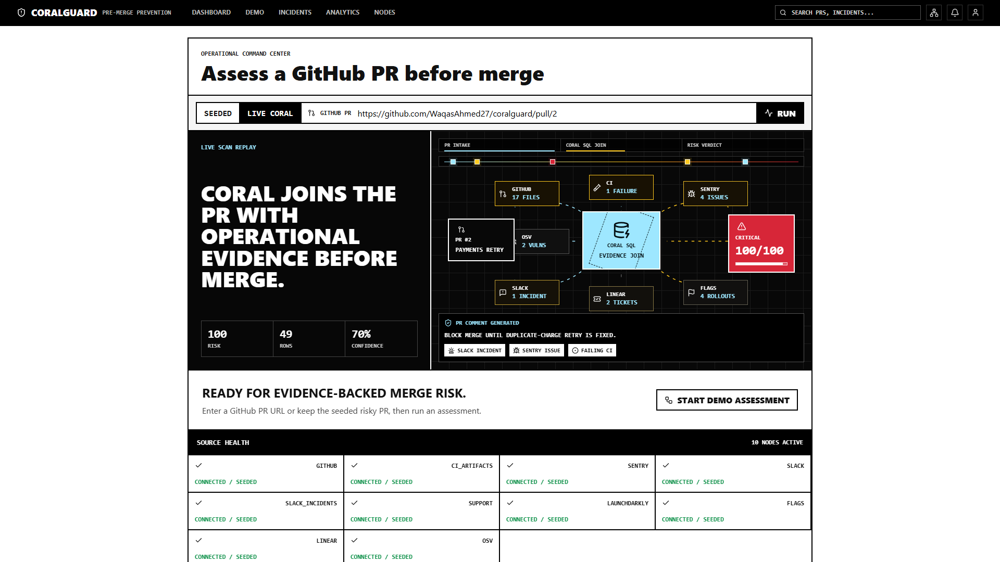
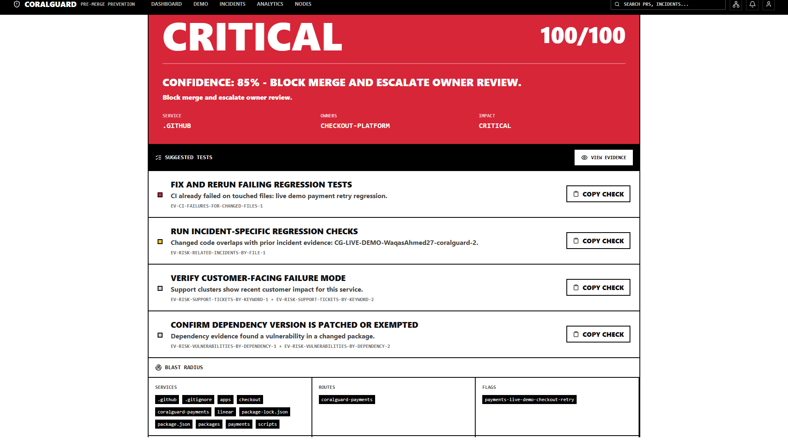
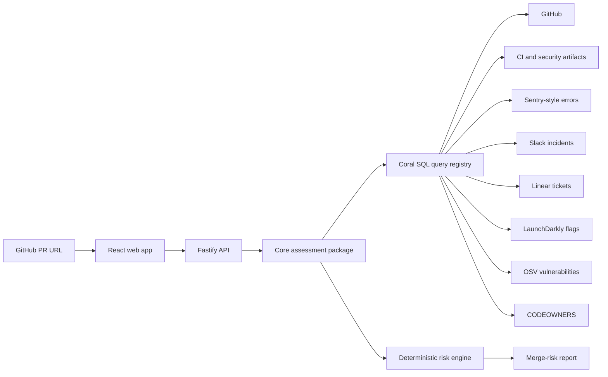
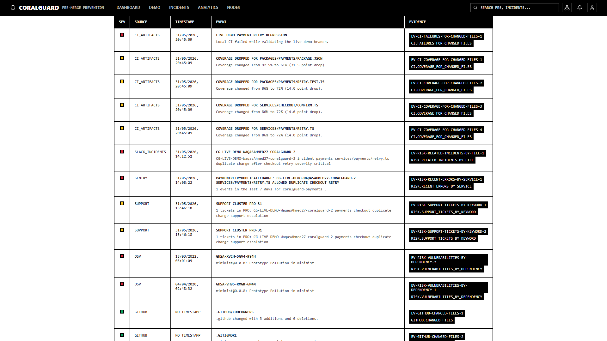

# CoralGuard

CoralGuard is a pre-merge incident prevention agent for enterprise engineering teams. A reviewer gives it a GitHub pull request URL, and CoralGuard uses Coral SQL sources to join evidence from code changes, CI artifacts, Sentry-style errors, Slack incidents, Linear support tickets, LaunchDarkly flags, OSV vulnerabilities, and ownership data.

The result is a deterministic merge-risk report with cited evidence, blast radius, suggested tests, rollback guidance, source health, and a GitHub-ready PR comment.



## Why it exists

Most production incidents have warning signs before merge, but those signs are spread across tools. CoralGuard brings them into the review flow while there is still time to prevent the incident.

It is designed for the WeMakeDevs Coral Hackathon Track 1: Build an Enterprise Agent.

## What it does

- Accepts a GitHub PR URL and validates the owner, repo, and PR number.
- Runs a fixed registry of Coral SQL queries across live or seeded sources.
- Normalizes evidence into typed Zod schemas.
- Scores risk deterministically, without asking an LLM to invent severity.
- Requires structured citations for high-risk claims.
- Generates suggested tests, blast radius, rollback steps, owner routing, and a PR comment.
- Reports source health and gracefully degrades when optional sources are missing.
- Redacts secrets and PII before content is displayed.



## Architecture



Coral is the retrieval and join layer. The application does not accept user-written SQL; it runs registered query templates through a safe Coral CLI wrapper that uses argument arrays. Demo mode uses seeded JSONL data with the same query IDs as live mode, so the product remains reliable from a clean checkout.

## Tech stack

- TypeScript monorepo with npm workspaces
- React and Vite web app
- Fastify API server
- Zod schemas for input, evidence, and report contracts
- Coral CLI integration through a safe wrapper
- Coral JSONL sources for seeded and local artifact data
- Vitest for unit and integration coverage
- Playwright for end-to-end UI coverage

## Repository layout

```text
apps/web                 React UI, Fastify API, Playwright tests
packages/core            PR parsing, Coral queries, scoring, report generation
packages/sources         Coral source manifests and seeded JSONL data
scripts                  Demo, live-source install, and readiness scripts
docs                     Architecture, live demo, threat model, assets
services                 Sample service files used by demo PRs
```

## Quick start

Install dependencies:

```bash
npm install
```

Run the seeded demo assessment:

```bash
npm run demo -- https://github.com/WaqasAhmed27/coralguard/pull/2
```

Start the web UI:

```bash
npm run dev
```

Open the local app at the Vite URL printed in the terminal, usually `http://127.0.0.1:5173/`.

## Live demo

For a live-credential demo, create a local environment file and install live Coral sources:

```powershell
Copy-Item .\env.live.example .\.env.live.local
npm run set:live-secrets
npm run check:live-env
npm run install:live-sources
npm run dev:live
```

Use strict readiness when all live credentials should be required:

```powershell
npm run install:live-sources:strict
npm run check:live-readiness
```

Credential files and Coral config directories are gitignored. Do not commit `.env.live.local`, `.coral-live-config`, or generated local source manifests.

More details are in [docs/live-demo.md](docs/live-demo.md).

## Evidence-first reports

CoralGuard shows the evidence behind the score instead of producing a vague summary. Each row is normalized, redacted, hashed, and tied back to its source and query.



## Testing

Run the main test suite:

```bash
npm test
```

Run type checking:

```bash
npm run typecheck
```

Run the end-to-end UI test:

```bash
npm run test:e2e
```

The tests cover deterministic scoring, input validation, missing-source handling, redaction, prompt-injection resistance, and the browser flow.

## Security model

CoralGuard treats source data as untrusted. The core controls are:

- Strict GitHub PR URL parsing.
- Safe shell execution with `spawn` argument arrays.
- Query registry instead of scattered SQL strings.
- No user-authored SQL execution.
- Central secret and PII redaction.
- Prompt-injection detection that can reduce confidence but cannot change scoring.
- Evidence citations required for high-risk claims.

See [docs/threat-model.md](docs/threat-model.md) for the concise threat model.

## Demo video

The generated submission video is stored locally under `reports/demo-video/submission/out/coralguard-submission-demo.mp4`. The reports directory is intentionally ignored because it contains generated artifacts.

